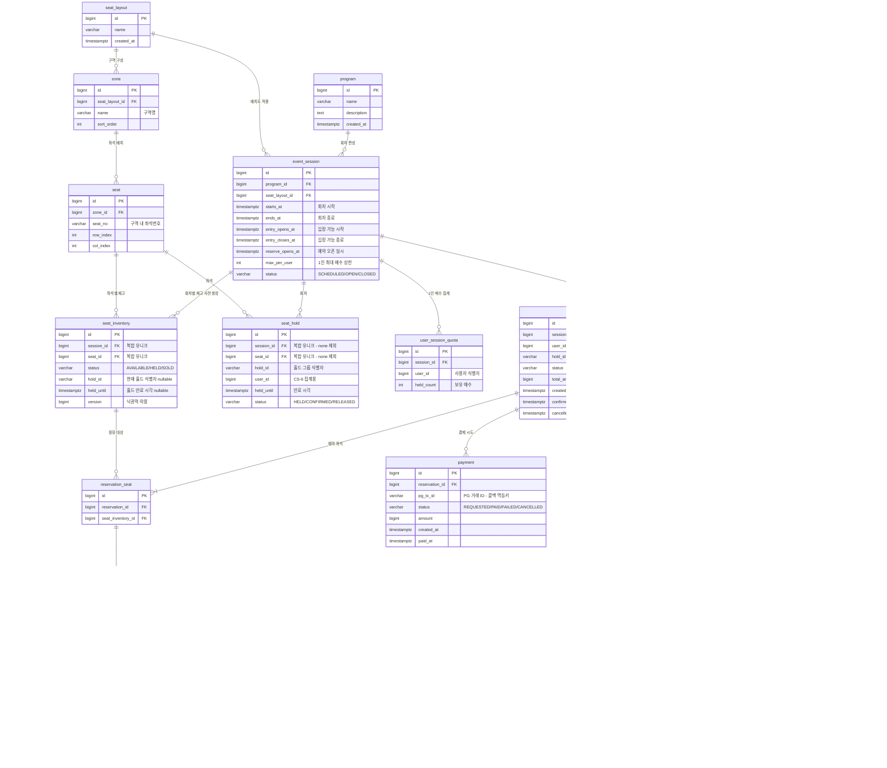

# ERD — 도메인 모델

**holdfast** — 좌석 단위 점유 제어 · 예약·발권 시스템

`docs/design-spec.md` 3.2절이 지정한 도메인 모델을 확정한 문서다. 엔티티 목록과
컬럼은 `docs/concurrency-spec.md` 2절(`seat_inventory`)·2.2절(`seat_hold`)·
1.1절(`user_session_quota`)·6절(멱등성)에 정의된 것을 그대로 반영한다.

테이블별 REQ 번호는 `design-spec.md` 3.1절 요구사항 추적표를 기준으로 한다.

---

## 1. ERD



---

## 2. 테이블별 REQ 매핑

`design-spec.md` 3.1절 기준이다.

| 테이블 | 역할 | REQ |
|---|---|---|
| `program` | 프로그램 마스터 | REQ-02 |
| `event_session` | 회차. 입장 가능시간·예약 오픈 일시·1인 매수 상한 보유 | REQ-02, REQ-06, REQ-08 |
| `seat_layout` | 좌석배치도 | REQ-09 |
| `zone` | 배치도 내 구역 | REQ-09 |
| `seat` | 구역 내 좌석 | REQ-09 |
| `seat_inventory` | 회차 × 좌석 재고 행. 좌석 단위 점유의 경합 대상 | REQ-01, REQ-02, REQ-09 |
| `seat_hold` | 홀드 이력과 유일성. 초과 홀드의 최후 방어선 | REQ-01, REQ-03, REQ-09 |
| `user_session_quota` | `(회차, 사용자)` 단위 보유 매수 집계 | REQ-03 |
| `reservation` | 예약 헤더와 상태 | REQ-01, REQ-03, REQ-04 |
| `reservation_seat` | 예약에 속한 좌석 N건 | REQ-01, REQ-09 |
| `payment` | Mock PG 결제 시도와 결과 | REQ-04 |
| `ticket` | QR 모바일 티켓 | REQ-07 |
| `ticket_scan` | 검표 이력. 입장 가능시간·중복 사용 판정 결과 | REQ-06 |
| `outbox` | 알림 발송 큐. 재시도·중복 발송 방지 | REQ-05 |
| `idempotency_record` | 예약 요청 멱등키와 응답 재생 | REQ-03, REQ-04 |

**REQ-10(응답시간 p95 3초)에 대응하는 테이블은 없다.** 특정 테이블이 아니라 전
구간의 성능 목표이므로 `concurrency-spec.md` 7절의 측정 설계에서 다룬다.

---

## 3. 유니크 제약

| # | 대상 | 컬럼 | 종류 | 목적 | 적용 |
|---|---|---|---|---|---|
| U-1 | `seat_inventory` | `(session_id, seat_id)` | 유니크 인덱스 | 재고 행 중복 생성 방지 | **5개 전략 전부** |
| U-2 | `seat_hold` | `(session_id, seat_id)` `WHERE status = 'HELD'` | 부분 유니크 인덱스 | 활성 홀드 중복 차단 — 최후 방어선 | **`none` 제외 4개** |
| U-3 | `zone` | `(seat_layout_id, name)` | 유니크 인덱스 | 배치도 내 구역명 중복 방지 | 전부 |
| U-4 | `seat` | `(zone_id, seat_no)` | 유니크 인덱스 | 구역 내 좌석번호 중복 방지 | 전부 |
| U-5 | `user_session_quota` | `(session_id, user_id)` | 유니크 인덱스 | 집계 행 중복 생성 방지 | 전부 |
| U-6 | `reservation` | `(hold_id)` | 유니크 인덱스 | 홀드 그룹당 예약 1건 | 전부 |
| U-7 | `reservation_seat` | `(reservation_id, seat_inventory_id)` | 유니크 인덱스 | 한 예약 안의 좌석 중복 방지 | 전부 |
| U-8 | `payment` | `(pg_tx_id)` | 유니크 인덱스 | 결제 콜백 멱등성 | 전부 |
| U-9 | `ticket` | `(reservation_seat_id)` | 유니크 인덱스 | 예약좌석당 티켓 1장 | 전부 |
| U-10 | `ticket` | `(qr_token)` | 유니크 인덱스 | QR 토큰 유일성 | 전부 |
| U-11 | `ticket_scan` | `(ticket_id)` `WHERE result = 'ADMITTED'` | 부분 유니크 인덱스 | 티켓 중복 사용 차단 | 전부 |
| U-12 | `outbox` | `(reservation_id, notification_type)` | 유니크 인덱스 | 중복 발송 방지 | 전부 |
| U-13 | `idempotency_record` | `(idempotency_key)` | 유니크 인덱스 | 예약 요청 멱등성 | 전부 |

U-1·U-2의 역할 구분은 `concurrency-spec.md` 2.1절에 있다. **U-1은 초과 예약을
막지 못한다.** 재고 행은 어차피 하나뿐이고, 초과 예약은 그 하나의 행을 두 요청이
각각 UPDATE하면서 발생한다. 행의 유일성과 점유의 유일성은 다른 문제다.

### 3.1 U-2를 `none`에서만 제외하는 이유

**이 결정을 임의로 뒤집지 않는다.** 근거는 `concurrency-spec.md` 2.1절이다.

일반적으로는 제약을 항상 거는 것이 옳다. 그러나 이 프로젝트에서 `holdfast.strategy=none`은
전략이 아니라 **"락 없이 돌렸을 때 초과 예약이 몇 건 나는가"라는 실패 증거를 만드는
베이스라인**이다. 제약을 걸어두면 초과 예약이 0건으로 나와 2개월차 산출물인 실패
데이터를 얻을 수 없고, 나머지 4개 전략이 무엇을 고쳤는지 말할 근거가 사라진다.

제거 방식은 **마이그레이션 분기가 아니라 시드 스크립트의 인덱스 생성/삭제**다.
`holdfast.strategy=none`이면 측정 시작 전에 `DROP INDEX`, 그 외에는
`CREATE UNIQUE INDEX`. 스키마 파일은 하나로 유지된다.

U-1은 재고 행의 유일성이지 점유의 유일성이 아니므로 5개 전략 전부에 항상 건다.

---

## 4. 확정 기록

착수 후 논쟁이 반복되지 않도록, 명세에 없어 이 문서에서 정한 사항을 남긴다.

**티켓은 예약좌석당 1장으로 발급한다.** REQ-06의 중복 사용 차단이 좌석 단위여야
`ticket_scan`의 `(ticket_id)` 유니크 하나로 처리되고, 예약당 1장이면 "N회까지 유효"
카운터가 필요해져 그 카운터가 검표 단말 다중 스캔에서 새로운 임계 구역이 되기
때문이다 — 측정 대상과 무관한 동시성 문제를 늘리지 않는다. `design-spec.md` 3.2의
트리는 관계만 표시한 스케치이므로 발권 단위의 근거로 쓰지 않는다.

**U-2와 U-11은 부분 유니크 인덱스다.** `seat_hold`는 `status`에 `RELEASED`를 두어
홀드의 **이력**을 남기므로(`concurrency-spec.md` 2.2), 전체 행에 유니크를 걸면 홀드가
한 번 해제된 좌석을 다시 홀드할 수 없게 되어 `design-spec.md` 4.1의 "취소 시 좌석
반환"이 성립하지 않는다. 유일성과 이력이 동시에 성립하려면 부분 인덱스여야 한다.
`ticket_scan`도 같은 이유로 실패 스캔 이력을 남기되 성공 입장(`ADMITTED`)만 티켓당
1건으로 제한한다.

**U-2의 조건은 `status = 'HELD'`다. `CONFIRMED`를 포함하지 않는다.** `CONFIRMED`가
인덱스에 남으면 "판매된 좌석의 재홀드 차단"까지 이 제약이 떠맡게 되는데, 그 책임은
`seat_inventory.status`의 조건부 UPDATE에 있다(`concurrency-spec.md` 3절의 확정
쿼리). **같은 사실을 두 곳에서 지키면 어긋난다.**

측정 해석에서도 이 편이 낫다. 제약 위반 카운터가 **"앱 락이 샜다"만 세도록** 유지해야
`concurrency-spec.md` 7.1의 "정상 거절과 오류를 분리한다"가 지켜진다. 조건에
`CONFIRMED`를 넣으면 이미 팔린 좌석에 대한 정상 거절까지 같은 카운터에 섞여, 7.6
기록 양식의 제약위반 열이 무엇을 뜻하는지 흐려진다.

**`event_session`이 `seat_layout`을 참조한다.** `seat_inventory`를 회차 × 좌석 행으로
사전 생성하려면 그 회차에 어떤 좌석이 속하는지 알아야 하고, 그 출처가 배치도다.

**사용자 테이블은 만들지 않는다.** 지정된 엔티티 목록에 없으므로 `user_id`는 외래키
없는 식별자 컬럼으로 둔다. 인증·회원 관리는 이 프로젝트의 요구사항 추적표에 없다.

**예약은 홀드 시점에 생성된다.** `design-spec.md` 3.3의 예약 상태 전이가
`선점 → 결제대기 → 확정 → 취소`로 `선점` 상태를 포함하므로, `reservation`은 확정
시점이 아니라 홀드 시점에 만들어지고 `hold_id`로 `seat_hold` 그룹과 연결된다.

**홀드가 만료돼도 `reservation` 행은 지우지 않는다.** `status`를 `EXPIRED`로 전이시키고
행을 남긴다(`design-spec.md` 3.3의 `선점 → 만료`). 만료 판정의 정본은 `held_until`과
DB `now()`의 비교이며(`concurrency-spec.md` 3절), `status` 컬럼은 그 판정의 결과를
반영한 것이지 판정 근거가 아니다. 한 번의 만료로 네 곳이 함께 바뀐다.

| 대상 | 전이 |
|---|---|
| `reservation.status` | `HELD` → `EXPIRED` |
| `seat_hold.status` | `HELD` → `RELEASED` |
| `seat_inventory` | `status`를 `HELD` → `AVAILABLE`, `hold_id`·`held_until`을 `NULL` |
| `user_session_quota.held_count` | 홀드했던 좌석 수만큼 감소 |

이 전이도 `concurrency-spec.md` 5.1의 전역 락 순서(사용자 할당량 행 → 좌석 행)를 따른다.
만료된 예약에는 결제가 붙지 않으므로 `payment` 행도 생기지 않는다.

**정리되지 않은 만료 홀드는 재홀드를 막는다.** U-2가 `status = 'HELD'`에만 걸리므로,
만료됐지만 아직 `RELEASED`로 전이되지 않은 행이 남아 있으면 같은 좌석에 대한 새 홀드
INSERT가 유니크 위반으로 거절된다. `concurrency-spec.md` 3절의 스케줄러는 여기서도
보조이며 스케줄러가 죽어도 정합성은 깨지지 않지만, 좌석이 다시 팔릴 수 있는지는 이
정리에 의존하므로 정리를 스케줄러에만 맡기지 않고 홀드 경로에 둔다. 절차는 4.1에 있다.

**결제는 예약당 N건이다.** Mock PG의 실패·타임아웃 재시도가 이력으로 남아야 하므로
`reservation : payment`를 1:N으로 두고, 멱등성은 `pg_tx_id` 유니크(U-8)가 담당한다.

### 4.1 만료 홀드 정리 절차

**정리와 INSERT를 두 단계로 나누면 안 된다.** 만료 행을 조회로 발견한 뒤 무조건
`RELEASED`로 바꾸고 INSERT하면, 두 요청이 동시에 같은 만료 행을 발견했을 때 둘 다
정리에 성공했다고 믿고 둘 다 INSERT를 시도한다. U-2가 두 번째를 막지만 그 대가로 제약
위반 카운터가 올라간다. 이 카운터는 "앱 락이 샜다"만 세야 하므로
(`concurrency-spec.md` 7.1·7.6) 만료 정리 경쟁이 섞이면 측정 해석이 흐려진다.

**정리를 조건부 UPDATE로 정의하고 `rowsAffected`를 판정에 쓴다.**

```sql
UPDATE seat_hold
   SET status = 'RELEASED'
 WHERE session_id = ? AND seat_id = ?
   AND status = 'HELD'
   AND held_until <= now();
```

`concurrency-spec.md` 3절의 확정 쿼리와 같은 패턴이다. 판정이 단일 SQL 문 안에서
원자적으로 끝나므로 "조회 후 정리" 사이의 틈이 존재하지 않는다.

| `rowsAffected` | 의미 | 처리 |
|---|---|---|
| 1 | 내가 만료 행을 정리했다 | INSERT 진행 |
| 0 | 다른 요청이 이미 정리했다 | 재조회하거나 409로 거절 |

이 판정은 **만료된 `HELD` 행을 발견한 경우에만** 적용한다. 홀드 행이 아예 없으면 정리할
대상이 없으므로 곧바로 INSERT하고, `held_until`이 아직 지나지 않은 `HELD` 행이면 정상
점유이므로 정리 없이 409로 거절한다. `rowsAffected = 0`을 무조건 거절로 해석하면 비어
있는 좌석까지 거절하게 된다. 이때의 409는 정상 거절이지 오류가 아니다(7.1).

**전역 락 순서에서의 위치.** `concurrency-spec.md` 5.1의 전역 순서는 사용자 할당량 행 →
좌석 행(오름차순)이다. 정리 UPDATE는 `seat_hold` 행에 쓰기 락을 잡으므로 **좌석 단계에
속하며, 사용자 할당량 행을 잠근 뒤에 수행한다.** 순서를 뒤집어 `seat_hold` 행을 잡은 채
할당량 행을 기다리면 역순이 생겨 데드락이 난다. 여러 좌석을 한 번에 홀드할 때는 정리
UPDATE도 좌석 ID 오름차순으로 수행하고, 좌석 하나 안에서는 `seat_inventory` →
`seat_hold` 순으로 고정한다.

```
user_session_quota 행 잠금
  └─ 좌석 ID 오름차순 루프
       ├─ 전략별 락 획득
       ├─ seat_inventory 접근
       ├─ seat_hold 정리 UPDATE   ← 여기
       └─ seat_hold INSERT
```

**전략별 수행 시점.**

| 전략 | 정리 UPDATE 시점 |
|---|---|
| `none` | 홀드 경로에서 수행하지 않는다. U-2가 없어 만료 행이 INSERT를 막지 않고, `rowsAffected` 게이트는 앱 레벨 방어라 베이스라인에 넣으면 실패 증거가 흐려진다. 정리는 스케줄러에만 맡긴다 |
| `pessimistic` | 해당 좌석의 `seat_inventory` 행을 `FOR UPDATE`로 잡은 직후 같은 트랜잭션 안에서 수행한다. 행 락이 이미 직렬화하므로 `rowsAffected = 0` 분기는 사실상 나오지 않지만, 전략 간 코드 경로를 같게 두기 위해 판정은 유지한다 |
| `optimistic` | `seat_inventory`의 조건부 UPDATE(`version` 비교)가 성공한 뒤 수행한다. 여기서 `rowsAffected = 0`이면 충돌로 보고 4.3의 재시도 상한 3회·지수 백오프에 태운다 |
| `unique` | **앱 락이 없어 이 UPDATE가 유일한 직렬화 지점이다.** INSERT 직전에 단독으로 수행하고, `rowsAffected = 0`이면 재시도 없이 409로 거절한다. 이 전략은 제약 위반을 정상 동작으로 세므로(4.4) 앱 레벨 재시도를 넣으면 다른 전략과 비교가 깨진다 |
| `redis` | `lock:seat:{sessionId}:{seatId}`를 트랜잭션 시작 전에 획득한 뒤 트랜잭션 안에서 수행한다. 락이 정리와 INSERT를 함께 감싸므로 두 단계 사이가 벌어지지 않는다. 해제는 커밋 이후 `afterCompletion`(5.2) |

`pessimistic`·`optimistic`·`redis`에서 제약 위반은 0이어야 한다(7.6). `unique`는 제약
위반이 정상 동작이지만 그 값은 **좌석을 동시에 노린 정상 경합만** 반영해야 하며, 만료
정리 경쟁이 섞이면 안 된다. 위 `rowsAffected` 게이트가 그 분리를 담당한다.

---

## 5. 참고 — 상태 전이

`design-spec.md` 3.3절과 `concurrency-spec.md` 2절에서 확정된 것이다.

```
seat_inventory : AVAILABLE ──hold──> HELD ──confirm──> SOLD
                     ^                 │                 │
                     └────expire───────┘                 │
                     └────────────cancel─────────────────┘

reservation    : HELD → PENDING_PAYMENT → CONFIRMED → CANCELLED
                 HELD → EXPIRED

ticket         : ISSUED → USED
                 ISSUED → VOID
```

`outbox`는 `SELECT ... FOR UPDATE SKIP LOCKED`로 집는다(`concurrency-spec.md` 6절).
앱 2대가 같은 행을 잡지 않으면서 한쪽이 죽어도 다른 쪽이 이어받는다.

---

## 6. 범위 밖

`design-spec.md` 4.3절 "구현하지 않음"에 해당하므로 테이블을 만들지 않는다.

| 만들지 않는 테이블 | 사유 |
|---|---|
| 정산·환불 수수료 | 실제 PG 연동·정산 제외 |
| 관리자 권한, 감사 로그 | 국립 SFR-005 / SFR-007 제외 |
| 다국어 리소스 | 다국어 제외 |
| SMS·카카오 발송 이력 | Mock 대체. `outbox`로 갈음 |
| 검표 단말 마스터 | 물리 단말 연동 제외 |
| 통계 집계 테이블 | 통계 대시보드 고도화 제외 |

`design-spec.md` 4.2절의 "여유가 되면" 항목(대기열, 비회원 조회, 노쇼 처리)도 현재
ERD에 포함하지 않는다. 착수가 결정되면 그 시점에 이 문서를 갱신한다.
