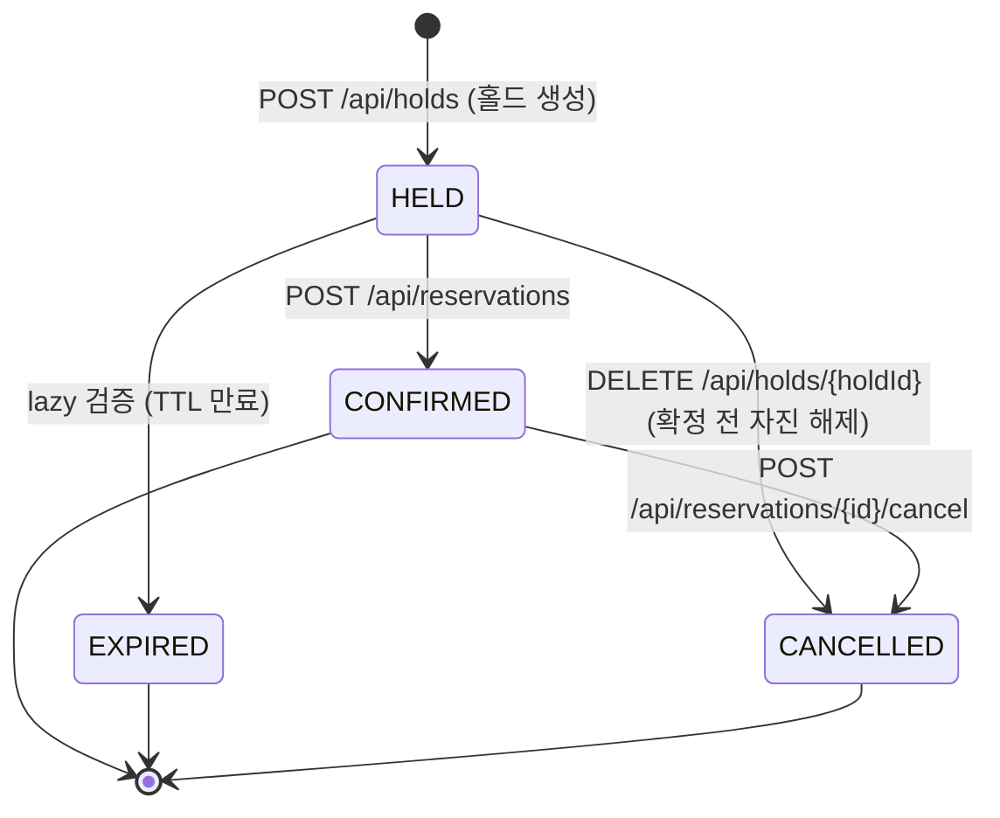
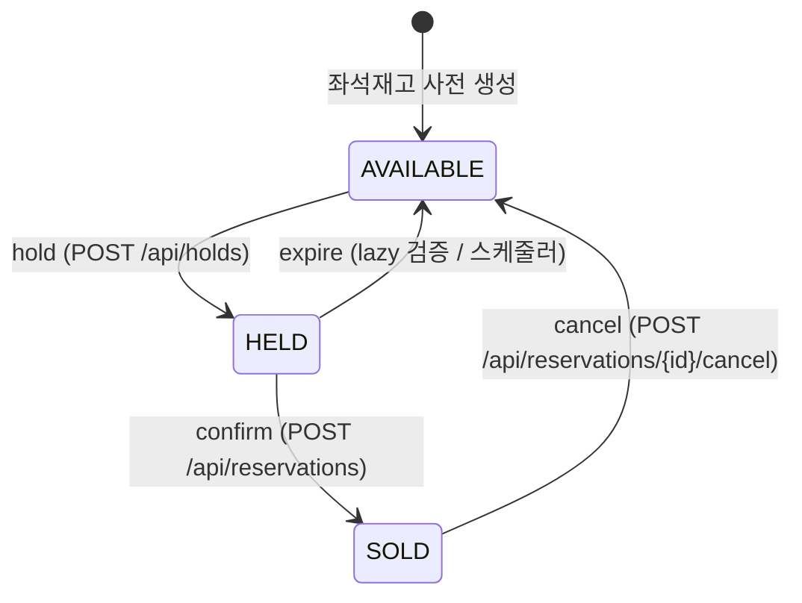
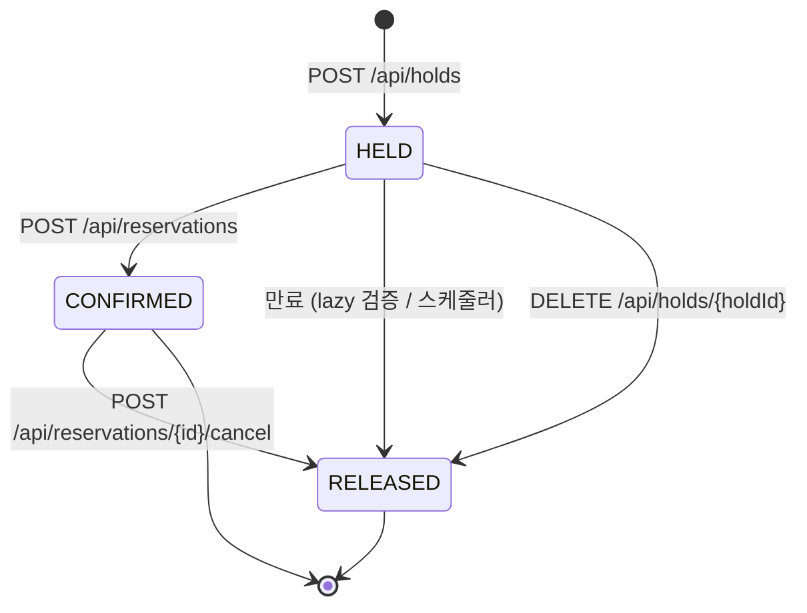
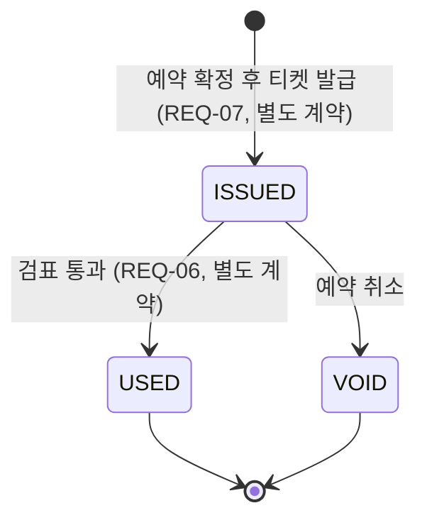
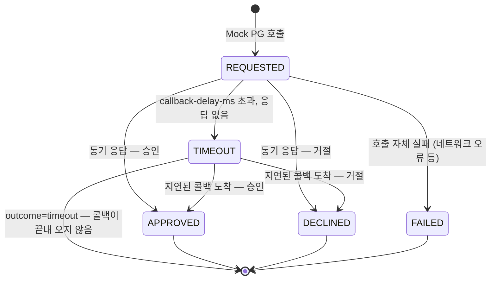

# 상태 전이 다이어그램

**holdfast** — 좌석 단위 점유 제어 예약·발권 시스템

`docs/design-spec.md` 3.3절이 지정한 산출물이다. `docs/erd.md`·`docs/concurrency-spec.md`에
흩어져 있던 상태 전이 정보를 다섯 개 상태 기계로 모으고, 전이마다 무엇이 그것을
일으키는지 · 함께 바뀌는 테이블이 무엇인지 · 원자성을 어떻게 보장하는지 정리한다.

**정본 표시 규칙.** 각 다이어그램 앞에 이미 확정된 내용인지, 이 문서에서 처음
정리하며 채운 추정인지 표시한다. 후자는 근거를 밝히고 확인이 필요하다는 점을
명시한다.

---

## 0. `seat_inventory`와 `seat_hold` — 어느 것이 정본인가

두 테이블은 같은 사건(홀드 획득·확정·만료·해제)에 함께 전이하므로, 다이어그램을
읽기 전에 이 관계부터 고정해야 혼동이 없다.

**`seat_hold`가 정본이고, `seat_inventory.status`는 파생이다.**

근거는 `concurrency-spec.md` 2.2절이다.

> `seat_inventory.status`와 `seat_hold`는 중복이 아니라 역할이 다르다. 전자는 좌석의
> 현재 상태를 읽기 위한 것이고, 후자는 홀드의 이력과 유일성을 보장하기 위한 것이다.

"누가 이 좌석을 정당하게 점유하고 있는가"라는 사실의 근거는 `seat_hold` 행의 존재와
U-2 제약(`erd.md` 3절)에 있다. `seat_inventory.status`는 그 사실을 좌석맵 조회처럼
빈번한 읽기에서 매번 `seat_hold`를 조회·집계하지 않아도 되게 만든 **읽기 최적화
프로젝션**이며, 같은 트랜잭션에서 함께 갱신되어 클라이언트에게는 결코 어긋난 값으로
관측되지 않는다.

**`none` 베이스라인이 이 관계를 거꾸로 증명한다.** `none`에서는 U-2가 빠져
`seat_hold`가 유일성을 더 이상 보장하지 못하고, `concurrency-spec.md` 4.1이 설명하는
"조회 후 UPDATE" 방식이 `seat_inventory`에 직접 적용된다. 정본이 없는 상태에서
파생값에 직접 쓰기 경쟁이 벌어지는 것이 정확히 초과 예약이 발생하는 경로다. 나머지
4개 전략이 다른 것은 `seat_inventory`를 지키는 락의 종류이지, `seat_hold`가 정본이라는
사실 자체는 아니다 — 4개 전략 모두 결국 `seat_hold`에 INSERT하고(`concurrency-spec.md`
2.2절), 그 INSERT가 유일성 판정의 최종 지점이다.

---

## 1. `reservation`

**확정.** `erd.md` 4절·5절과 `api-spec.md` 1.2절에 근거한다.

| 전이 | 행위 | 함께 바뀌는 테이블 | 원자성 보장 방식 |
|---|---|---|---|
| `[*] → HELD` | API 호출 — `POST /api/holds` | `seat_inventory`(`AVAILABLE→HELD`), `seat_hold`(INSERT `HELD`), `user_session_quota`(`held_count` 증가) | 전역 락 순서(`concurrency-spec.md` 5.1) 내 단일 트랜잭션, 좌석 ID 오름차순, 전부 아니면 전무(`api-spec.md` 4절) |
| `HELD → CONFIRMED` | API 호출 + lazy 검증 — `POST /api/reservations` | `seat_inventory`(`HELD→SOLD`), `seat_hold`(`HELD→CONFIRMED`) | 단일 조건부 UPDATE, `held_until > now()` 검사 포함(`concurrency-spec.md` 3절 확정 쿼리) |
| `HELD → EXPIRED` | lazy 검증(홀드 재획득 경로) 또는 스케줄러(보조) | `seat_hold`(`HELD→RELEASED`), `seat_inventory`(`HELD→AVAILABLE`), `user_session_quota`(감소) — 4곳(`erd.md` 4절) | 조건부 UPDATE + `rowsAffected` 판정(`erd.md` 4.1) |
| `HELD → CANCELLED` | API 호출 — `DELETE /api/holds/{holdId}` | `seat_inventory`(`HELD→AVAILABLE`), `seat_hold`(`HELD→RELEASED`), `user_session_quota`(감소) | 조건부 UPDATE, `reservation.status='HELD'` 확인 후 전이 |
| `CONFIRMED → CANCELLED` | API 호출 — `POST /api/reservations/{id}/cancel` | `seat_inventory`(`SOLD→AVAILABLE`), `seat_hold`(`CONFIRMED→RELEASED`) | 조건부 UPDATE, `reservation.status='CONFIRMED'` 확인 후 전이. 재호출 시 200과 기존 결과(`api-spec.md` 6.1절 멱등) |

**`PENDING_PAYMENT`는 이 다이어그램에 없다.** `erd.md` 스키마의 `reservation.status`
열거형에는 존재하지만(`HELD/PENDING_PAYMENT/CONFIRMED/CANCELLED/EXPIRED`), Mock PG
연동이 아직 별도 작업으로 남아 있어(`api-spec.md` 7절) 현재 계약의 확정은
`HELD → CONFIRMED` 직행이다(`api-spec.md` 1.2절). Mock PG 인터페이스가 확정되면
`HELD → PENDING_PAYMENT → CONFIRMED`로 이 다이어그램을 갱신한다.

**확정 — `CONFIRMED → CANCELLED` 시 `seat_hold`도 `RELEASED`로 전이한다.**
만료 처리와 동일하다. `seat_hold`는 홀드 레코드의 **생명주기만** 표현하는 테이블이고,
그 레코드가 왜 끝났는지(만료됐는지 취소됐는지)는 `seat_hold`가 구분할 일이 아니다 —
해제 사유는 `reservation.status`(`EXPIRED` 또는 `CANCELLED`)가 담당한다. `seat_hold`
쪽에 취소 전용 상태값을 따로 두면 U-2의 부분 인덱스 조건(`WHERE status = 'HELD'`,
`erd.md` 3.1절)이 그 값까지 제외 대상에 넣어야 해서 조건만 복잡해지고, 좌석이 다시
팔릴 수 있으려면 애초에 `HELD`가 아니기만 하면 충분하므로 얻는 것도 없다. `RELEASED`
하나로 "활성 홀드가 아니게 된 모든 경우"를 표현하고, 그 경우들 사이의 구분은
`reservation.status`에 맡긴다.

---

## 2. `seat_inventory`

**확정.** `concurrency-spec.md` 2절의 다이어그램을 그대로 옮긴다.

| 전이 | 행위 | 함께 바뀌는 테이블 | 원자성 보장 방식 |
|---|---|---|---|
| `[*] → AVAILABLE` | 시드 스크립트 — 회차 × 좌석 행 사전 생성(`concurrency-spec.md` 0.4) | 없음(최초 생성) | U-1 유니크 인덱스로 재고 행 중복 생성만 방지(`erd.md` 3절). 점유 유일성과는 무관 |
| `AVAILABLE → HELD` | API 호출 — `POST /api/holds`. 이 전이 자체가 CS-1(좌석 홀드 획득)이다 | `seat_hold`(INSERT), `reservation`(생성), `user_session_quota`(증가) | **전략마다 다르다** — `pessimistic`(`FOR UPDATE`), `optimistic`(조건부 UPDATE + `version`), `unique`(락 없음, `seat_hold` INSERT의 U-2 위반으로 사후 검출), `redis`(`RLock`), `none`(보호 없음 — 베이스라인) |
| `HELD → SOLD` | API 호출 + lazy 검증 — `POST /api/reservations` | `seat_hold`(`HELD→CONFIRMED`), `reservation`(`HELD→CONFIRMED`) | 단일 조건부 UPDATE(`concurrency-spec.md` 3절) |
| `HELD → AVAILABLE` (만료) | lazy 검증 또는 스케줄러(보조) | `seat_hold`(`RELEASED`), `reservation`(`EXPIRED`), `user_session_quota`(감소) | 조건부 UPDATE + `rowsAffected`(`erd.md` 4.1) |
| `SOLD → AVAILABLE` (취소) | API 호출 — `POST /api/reservations/{id}/cancel` | `seat_hold`(`RELEASED`, 1절 참조), `reservation`(`CANCELLED`) | 조건부 UPDATE, `reservation.status='CONFIRMED'` 확인 |

이 다이어그램의 `AVAILABLE → HELD` 행이 락 전략 비교의 실체다. 나머지 네 전이는
5개 전략에서 동일하게 처리된다(`concurrency-spec.md` 4절 — 전략 인터페이스가 감싸는
것은 `hold()` 메서드 하나뿐이다).

---

## 3. `seat_hold`

**확정.** `erd.md` 2.2절의 열거형(`HELD/CONFIRMED/RELEASED`)에 근거한다.

| 전이 | 행위 | 함께 바뀌는 테이블 | 원자성 보장 방식 |
|---|---|---|---|
| `[*] → HELD` | API 호출 — `POST /api/holds` | `seat_inventory`(`AVAILABLE→HELD`), `reservation`(생성), `user_session_quota`(증가) | 전략별 락(4절) + U-2 부분 유니크 인덱스가 최후 방어선 |
| `HELD → CONFIRMED` | API 호출 + lazy 검증 — `POST /api/reservations` | `seat_inventory`(`HELD→SOLD`), `reservation`(`HELD→CONFIRMED`) | 단일 조건부 UPDATE(`concurrency-spec.md` 3절) |
| `HELD → RELEASED` (만료) | lazy 검증(홀드 재획득 경로에서 발견 시) 또는 스케줄러(보조) | `seat_inventory`(`AVAILABLE`), `reservation`(`EXPIRED`), `user_session_quota`(감소) | 조건부 UPDATE + `rowsAffected`(`erd.md` 4.1) — 이 판정이 U-2가 만료 홀드에 걸려 재홀드가 막히는 것을 푸는 지점이다 |
| `HELD → RELEASED` (자진 해제) | API 호출 — `DELETE /api/holds/{holdId}` | `seat_inventory`(`AVAILABLE`), `reservation`(`CANCELLED`), `user_session_quota`(감소) | 조건부 UPDATE, `seat_hold.status='HELD'` 확인 후 전이 |
| `CONFIRMED → RELEASED` | API 호출 — `POST /api/reservations/{id}/cancel` | `seat_inventory`(`SOLD→AVAILABLE`), `reservation`(`CONFIRMED→CANCELLED`) | 조건부 UPDATE, `seat_hold.status='CONFIRMED'` 확인 후 전이 |

**U-2는 `status = 'HELD'`인 행만 본다.** `CONFIRMED`나 `RELEASED`로 전이한 행은 이미
제약의 보호 범위 밖이다(`erd.md` 3.1절). 그래서 `CONFIRMED → RELEASED` 전이 자체는
재홀드 차단과는 무관하다 — 이 전이가 존재하는 이유는 정합성 판정(U-2)이 아니라
**이력**(0절에서 `seat_hold`가 정본이라고 한 바로 그 역할)을 정확하게 유지하기
위해서다. `RELEASED`는 "활성 홀드가 아니게 된 모든 경우"를 가리키는 하나의 값이고,
그 경우가 만료였는지 자진 해제였는지 취소였는지는 `reservation.status`가 구분한다.

---

## 4. `ticket`

**부분 확정.** 상태값 자체는 `design-spec.md` 3.3절과 `erd.md`의
`ticket.status`(`ISSUED/USED/VOID`)로 확정돼 있다. 발급·검표 엔드포인트는
`api-spec.md` 7절에 따라 이 계약의 범위 밖(4개월차, 별도 계약)이므로, 전이를
일으키는 행위의 세부는 그 작업에서 확정될 때까지 잠정이다.

| 전이 | 행위 | 함께 바뀌는 테이블 | 원자성 보장 방식 |
|---|---|---|---|
| `[*] → ISSUED` | 예약 확정 직후 발급 (**잠정** — 확정 트랜잭션과 같은 트랜잭션인지, 사후 비동기인지는 발권 작업에서 정한다) | `reservation_seat`(이미 존재하는 행에 1:1 연결, U-9) | U-9(`reservation_seat_id` 유니크)가 예약좌석당 1장을 보장(`erd.md` 4절) |
| `ISSUED → USED` | 검표(**잠정** — API 호출 또는 다른 트리거인지는 별도 계약에서 정한다), lazy 검증(입장 가능시간) | `ticket_scan`(`ADMITTED` INSERT) | U-11 부분 유니크 인덱스(`ticket_id`, `WHERE result = 'ADMITTED'`)가 중복 사용을 막는다(`erd.md` 3절) |
| `ISSUED → VOID` | 예약 취소(**잠정** — `POST /api/reservations/{id}/cancel`과 같은 트랜잭션인지는 확인 필요) | `reservation`(`CONFIRMED→CANCELLED`) | 미확정 — 발권 도메인은 박태준 담당(`roles.md`)이며 원자성 방식은 그 작업에서 확정한다 |

**이 다이어그램 전체를 확정으로 취급하지 않는다.** 좌석·예약 도메인(최건 담당)과
달리 발권·검표(박태준 담당, `roles.md`)는 아직 API 계약이 없다. 여기 적은 것은
`design-spec.md` 3.3절의 상태값과 `erd.md`의 열거형에서 논리적으로 따라 나오는
최소한의 전이이며, 발권 API 계약이 확정되면 이 절을 그 계약에 맞춰 갱신해야 한다.

---

## 5. `payment` — Mock PG 기준

**확정.** `roles.md`가 최건에게 배정한 결정이다 — "Mock PG는 박태준이 만들되,
인터페이스는 최건이 정한다." 아래가 그 인터페이스다. `erd.md`의
`payment.status` 열거형(`REQUESTED/PAID/FAILED/CANCELLED`)은 Mock PG가 범위 밖이던
시점에 놓아둔 자리표시자였고, 이 확정으로 대체된다. **`erd.md`의 해당 스키마 블록은
별도로 갱신이 필요하다** — 이 문서만으로는 `erd.md`를 고치지 않는다(5.3절 참조).

| 전이 | 행위 | 함께 바뀌는 테이블 | 원자성 보장 방식 |
|---|---|---|---|
| `[*] → REQUESTED` | Mock PG 호출. `reservation`당 N건이므로(`erd.md` 4절) 재시도마다 새 행이 생긴다 — 기존 행이 `REQUESTED`로 되돌아가지 않는다 | 없음(신규 행) | 없음 — 단순 INSERT |
| `REQUESTED → APPROVED` | Mock PG의 동기 응답(승인) | `reservation`(`HELD→PENDING_PAYMENT→CONFIRMED`, 현재 계약에서는 미사용 — 1절 참조) | 없음 — 단일 요청·단일 응답으로 종결 |
| `REQUESTED → DECLINED` | Mock PG의 동기 응답(거절) | 없음 | 없음 |
| `REQUESTED → FAILED` | 호출 자체의 실패(네트워크 오류·5xx 등). **승인이 없었음이 확실하다** | 없음 | 없음 |
| `REQUESTED → TIMEOUT` | `callback-delay-ms` 초과까지 응답이 오지 않음. **승인 여부를 모르는 상태** | `seat_hold`·`seat_inventory`·`reservation`을 만료 경로로 되돌릴 수 있다(1~3절의 만료 전이) | 없음 — 이 시점부터가 문제 구간의 시작이다 |
| `TIMEOUT → APPROVED` / `TIMEOUT → DECLINED` | 지연된 비동기 콜백이 뒤늦게 도착 | 콜백이 `APPROVED`로 도착했는데 좌석이 이미 만료 처리됐다면 **정합성 깨짐** — 아래 참조 | U-8(`pg_tx_id` 유니크)이 콜백 멱등성을 보장(`concurrency-spec.md` 6절) |
| `TIMEOUT → [*]` | `outcome=timeout`으로 주입한 경우 — 콜백이 끝내 오지 않는다 | 없음 | 없음. 영구 미해결 건의 정기 대조는 `design-spec.md` 4.2절 "여유가 되면"의 정합성 대조 배치 영역이며 현재 범위 밖이다 |

### 5.1 `TIMEOUT`을 `FAILED`와 분리하는 이유

**`TIMEOUT`은 승인 여부를 모르는 상태이고, `FAILED`는 승인이 없었음이 확실한
상태다.** 이 구분이 이 상태 기계의 핵심이다.

`FAILED`는 호출 자체가 실패한 경우다 — 요청이 PG에 도달하지 못했거나 PG가 즉시
오류를 반환했으므로, 결제가 일어나지 않았다는 것을 우리 쪽에서 확신할 수 있다.
안전하게 좌석을 풀어주고 끝내면 된다.

`TIMEOUT`은 다르다. 요청은 보냈지만 **응답을 받지 못했을 뿐**이므로, PG 쪽에서는
실제로 승인이 처리됐을 수도 있다. 이 상태에서 시스템이 "실패로 간주하고 좌석을
풀어준 뒤" 나중에 승인 콜백이 도착하면, **좌석은 이미 해제됐는데 결제는 승인된**
정합성 깨짐이 발생한다 — `design-spec.md` 5.1이 경고하는 "만료와 확정의 경합"과
같은 계열의 문제이며, `concurrency-spec.md`의 CS-2(예약 확정)·CS-3(홀드 TTL 만료)를
결제 축에서 재현한 것이다.

`concurrency-spec.md` 6절의 결제 콜백 멱등성이 이 경로를 다룬다. `payment.pg_tx_id`
유니크 제약(U-8)이 늦게 도착한 콜백을 정확히 그 결제 시도와 연결하므로, `TIMEOUT`
행이 나중에 `APPROVED`로 풀려도 중복 승인 처리가 되지 않는다. 다만 **좌석이 이미
다른 사람에게 팔렸을 수 있다는 문제 자체는 멱등성으로 해결되지 않는다** — 멱등성은
"같은 콜백을 두 번 처리하지 않는다"를 보장할 뿐, "결제는 됐는데 좌석이 없다"는
상태를 해소하는 보상 로직은 별도다. 그 보상 로직(환불 처리 등)은
`design-spec.md` 4.3절에 따라 이 프로젝트의 범위 밖이며, 현재 계약은 이 상태가
**발생할 수 있다는 것을 재현하는 데까지**를 다룬다.

### 5.2 주입 파라미터

Mock PG의 동작은 요청 시점에 아래 프로퍼티로 제어한다. `SeatHoldStrategy`가
`holdfast.strategy`로 스위칭되는 것과 같은 방식이다.

| 파라미터 | 값 | 용도 |
|---|---|---|
| `holdfast.mock-pg.outcome` | `approve` / `decline` / `timeout` / `fail` / `random` | 이번 결제 시도가 도달할 결과 |
| `holdfast.mock-pg.outcome-weights` | 각 결과의 비율(`outcome=random`일 때만 사용) | 무작위 분포 조정 |
| `holdfast.mock-pg.delay-ms`, `holdfast.mock-pg.delay-jitter-ms` | 밀리초 | 동기 호출 자체의 응답 지연과 지터 주입 |
| `holdfast.mock-pg.callback-delay-ms` | 밀리초 | 비동기 콜백의 지연 — `REQUESTED → TIMEOUT` 전이를 일으키는 값 |

**`callback-delay-ms`가 이 파라미터들 중 유일하게 존재 이유가 측정과 직결된다.**
이 값을 홀드 TTL(`concurrency-spec.md` 3절)보다 길게 설정하면, 홀드가 먼저 만료돼
좌석이 풀리고 그 뒤에 결제 승인 콜백이 도착하는 순서를 **의도적으로** 재현할 수
있다. `design-spec.md` 5.1이 "발표에서 가장 좋은 소재"라고 부른 만료-확정 경합을
우연히 마주치길 기다리는 대신, 이 파라미터로 원할 때 재현하는 것이 존재 이유다.

**기본값은 `outcome=approve`, 지연 0이다.** 이 값은 `concurrency-spec.md` 7.3
고정 변수 표에 있다. 락 전략 비교가 목적인 시나리오에서 Mock PG 지연까지 섞이면
어느 지연이 락 대기이고 어느 지연이 결제 지연인지 구분할 수 없게 되어 측정이
오염된다. `callback-delay-ms`를 키운 시나리오는 락 전략 비교와 **별도로** 돌리고,
그 시나리오임을 보고서에 명시한다.

### 5.3 `erd.md`와의 불일치 — 별도 갱신 필요

이번에 확정한 상태값(`APPROVED/DECLINED/TIMEOUT/FAILED`)은 `erd.md`가 스키마에
적어둔 `payment.status` 열거형(`REQUESTED/PAID/FAILED/CANCELLED`)과 다르다. `PAID`가
`APPROVED`로 바뀌고, `DECLINED`·`TIMEOUT`이 새로 생기고, `CANCELLED`는 이 절의
상태 기계에서 빠졌다(취소는 `reservation.status`가 담당하고 `payment` 행 자체는
승인·거절·실패로 종결된 뒤 바뀌지 않는다 — `erd.md` 4절 "결제는 예약당 N건이다"와
일관된다).

**이 문서의 범위는 상태 전이 다이어그램이라 `erd.md`의 스키마 블록은 직접 고치지
않았다.** `erd.md`가 이 문서보다 먼저 병합된 확정 문서이므로, 스키마 자체를 여기서
같이 바꾸면 그 문서의 소유 범위를 침범하게 된다. `erd.md`의 `payment` 스키마 블록과
2절 REQ 매핑은 별도 PR로 갱신이 필요하다.

---

## 6. 검증

다섯 개 `stateDiagram-v2` 블록을 Mermaid CLI(`@mermaid-js/mermaid-cli`)로 실제
렌더링해 파싱 오류가 없는지 확인했다. 결과는 이 PR의 커밋 메시지와 설명에 남긴다.
