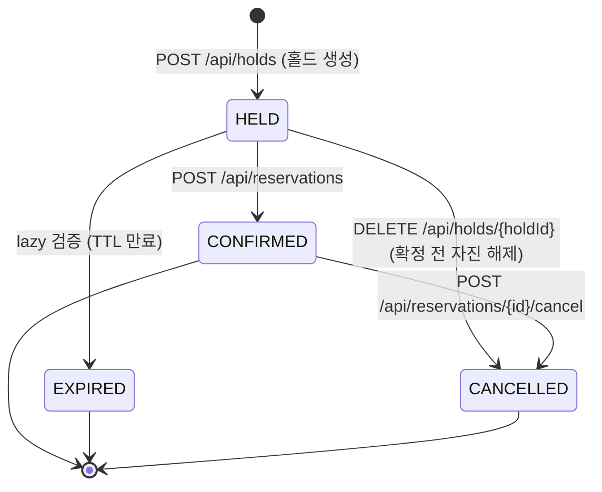
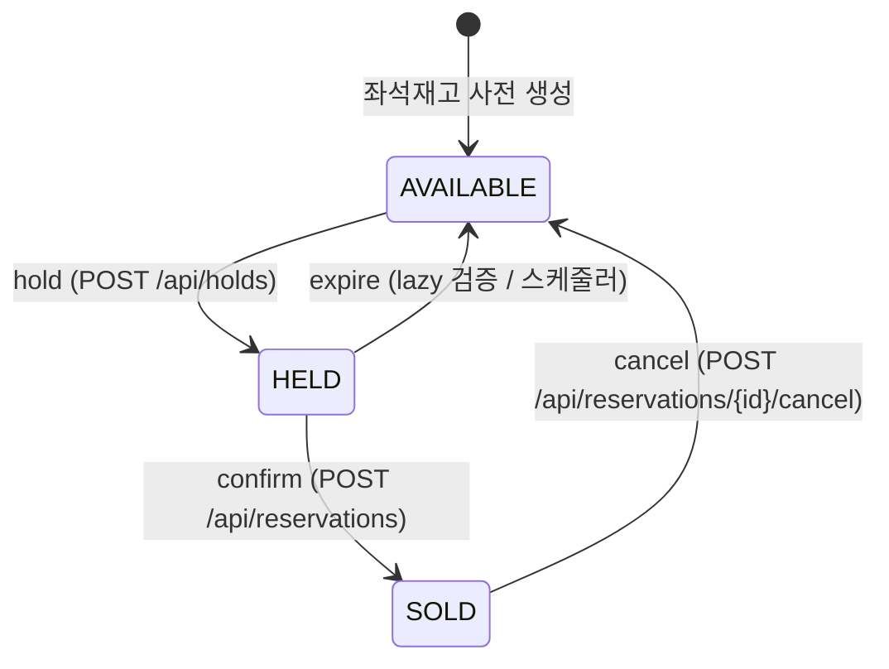
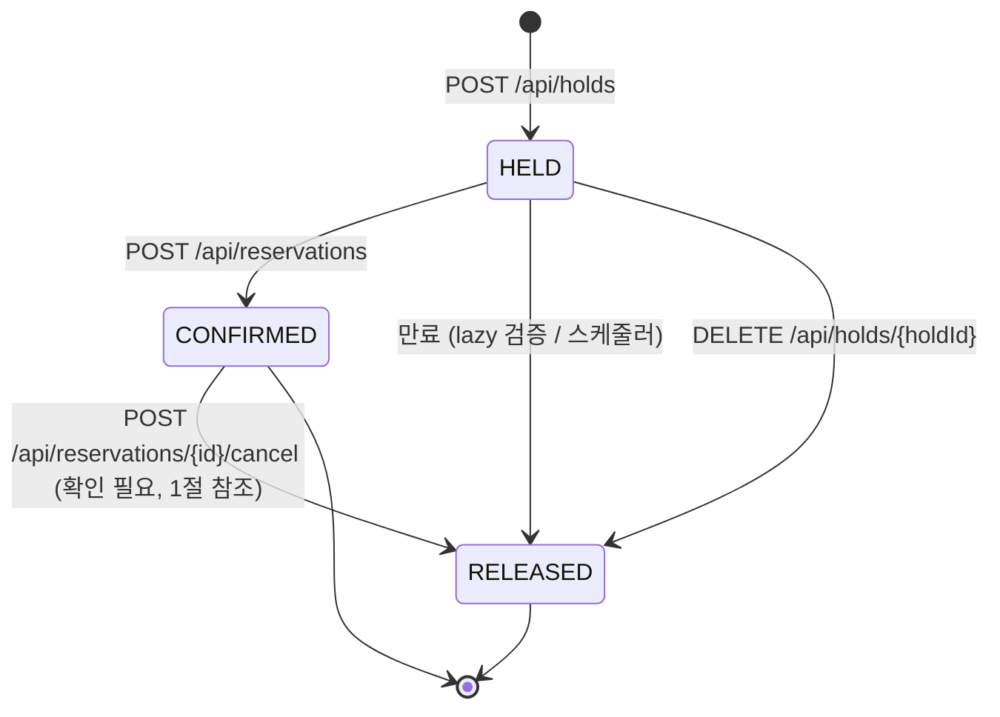
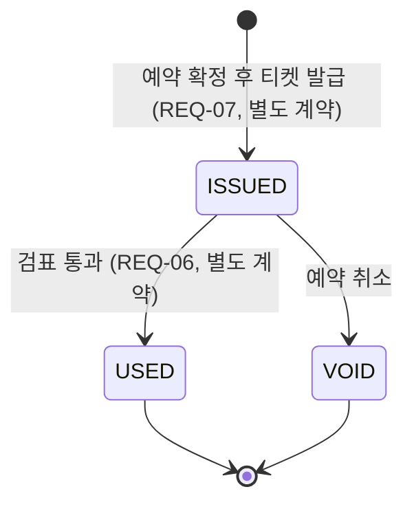
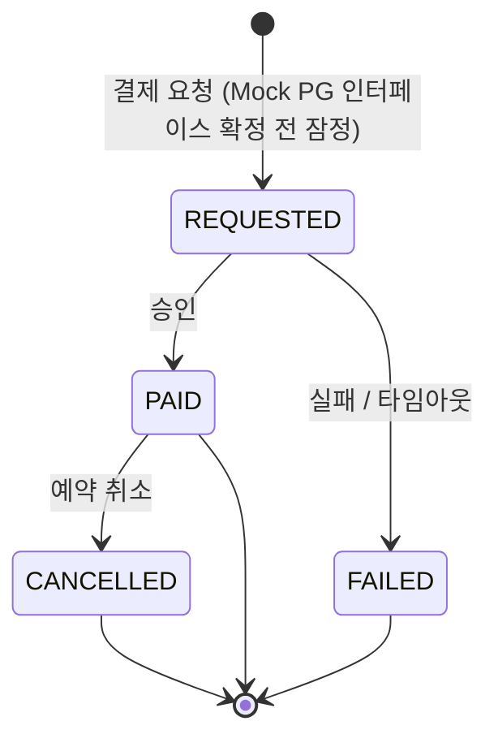

# 상태 전이 다이어그램

**holdfast** — 좌석 단위 점유 제어 예약·발권 시스템

`docs/design-spec.md` 3.3절이 지정한 산출물이다. `docs/erd.md`·`docs/concurrency-spec.md`에
흩어져 있던 상태 전이 정보를 다섯 개 상태 기계로 모으고, 전이마다 무엇이 그것을
일으키는지 · 함께 바뀌는 테이블이 무엇인지 · 원자성을 어떻게 보장하는지 정리한다.

**정본 표시 규칙.** 각 다이어그램 앞에 이미 확정된 내용인지, 이 문서에서 처음
정리하며 채운 추정인지 표시한다. 후자는 근거를 밝히고 확인이 필요하다는 점을
명시한다.

---

## 0. `seat_inventory`와 `seat_hold` — 어느 것이 정본인가

두 테이블은 같은 사건(홀드 획득·확정·만료·해제)에 함께 전이하므로, 다이어그램을
읽기 전에 이 관계부터 고정해야 혼동이 없다.

**`seat_hold`가 정본이고, `seat_inventory.status`는 파생이다.**

근거는 `concurrency-spec.md` 2.2절이다.

> `seat_inventory.status`와 `seat_hold`는 중복이 아니라 역할이 다르다. 전자는 좌석의
> 현재 상태를 읽기 위한 것이고, 후자는 홀드의 이력과 유일성을 보장하기 위한 것이다.

"누가 이 좌석을 정당하게 점유하고 있는가"라는 사실의 근거는 `seat_hold` 행의 존재와
U-2 제약(`erd.md` 3절)에 있다. `seat_inventory.status`는 그 사실을 좌석맵 조회처럼
빈번한 읽기에서 매번 `seat_hold`를 조회·집계하지 않아도 되게 만든 **읽기 최적화
프로젝션**이며, 같은 트랜잭션에서 함께 갱신되어 클라이언트에게는 결코 어긋난 값으로
관측되지 않는다.

**`none` 베이스라인이 이 관계를 거꾸로 증명한다.** `none`에서는 U-2가 빠져
`seat_hold`가 유일성을 더 이상 보장하지 못하고, `concurrency-spec.md` 4.1이 설명하는
"조회 후 UPDATE" 방식이 `seat_inventory`에 직접 적용된다. 정본이 없는 상태에서
파생값에 직접 쓰기 경쟁이 벌어지는 것이 정확히 초과 예약이 발생하는 경로다. 나머지
4개 전략이 다른 것은 `seat_inventory`를 지키는 락의 종류이지, `seat_hold`가 정본이라는
사실 자체는 아니다 — 4개 전략 모두 결국 `seat_hold`에 INSERT하고(`concurrency-spec.md`
2.2절), 그 INSERT가 유일성 판정의 최종 지점이다.

---

## 1. `reservation`

**확정.** `erd.md` 4절·5절과 `api-spec.md` 1.2절에 근거한다.

| 전이 | 행위 | 함께 바뀌는 테이블 | 원자성 보장 방식 |
|---|---|---|---|
| `[*] → HELD` | API 호출 — `POST /api/holds` | `seat_inventory`(`AVAILABLE→HELD`), `seat_hold`(INSERT `HELD`), `user_session_quota`(`held_count` 증가) | 전역 락 순서(`concurrency-spec.md` 5.1) 내 단일 트랜잭션, 좌석 ID 오름차순, 전부 아니면 전무(`api-spec.md` 4절) |
| `HELD → CONFIRMED` | API 호출 + lazy 검증 — `POST /api/reservations` | `seat_inventory`(`HELD→SOLD`), `seat_hold`(`HELD→CONFIRMED`) | 단일 조건부 UPDATE, `held_until > now()` 검사 포함(`concurrency-spec.md` 3절 확정 쿼리) |
| `HELD → EXPIRED` | lazy 검증(홀드 재획득 경로) 또는 스케줄러(보조) | `seat_hold`(`HELD→RELEASED`), `seat_inventory`(`HELD→AVAILABLE`), `user_session_quota`(감소) — 4곳(`erd.md` 4절) | 조건부 UPDATE + `rowsAffected` 판정(`erd.md` 4.1) |
| `HELD → CANCELLED` | API 호출 — `DELETE /api/holds/{holdId}` | `seat_inventory`(`HELD→AVAILABLE`), `seat_hold`(`HELD→RELEASED`), `user_session_quota`(감소) | 조건부 UPDATE, `reservation.status='HELD'` 확인 후 전이 |
| `CONFIRMED → CANCELLED` | API 호출 — `POST /api/reservations/{id}/cancel` | `seat_inventory`(`SOLD→AVAILABLE`), `seat_hold`(`CONFIRMED→RELEASED`, 아래 확인 필요) | 조건부 UPDATE, `reservation.status='CONFIRMED'` 확인 후 전이. 재호출 시 200과 기존 결과(`api-spec.md` 6.1절 멱등) |

**`PENDING_PAYMENT`는 이 다이어그램에 없다.** `erd.md` 스키마의 `reservation.status`
열거형에는 존재하지만(`HELD/PENDING_PAYMENT/CONFIRMED/CANCELLED/EXPIRED`), Mock PG
연동이 아직 별도 작업으로 남아 있어(`api-spec.md` 7절) 현재 계약의 확정은
`HELD → CONFIRMED` 직행이다(`api-spec.md` 1.2절). Mock PG 인터페이스가 확정되면
`HELD → PENDING_PAYMENT → CONFIRMED`로 이 다이어그램을 갱신한다.

**확인이 필요한 지점 — `CONFIRMED → CANCELLED` 시 `seat_hold`의 전이.**
`erd.md` 4절은 만료 시 `seat_hold`가 `RELEASED`로 전이한다고 명시하지만, 취소 시에도
같은 전이가 일어나야 하는지는 어느 문서에도 명시돼 있지 않다. 위 표는 만료 처리와
대칭이 되도록(활성 홀드가 아니게 된 행은 `RELEASED`로 남긴다) 추정해 채웠다. U-2의
조건(`status = 'HELD'`, `erd.md` 3.1절)이 `CONFIRMED` 행을 애초에 보호 대상에서 빼두었기
때문에 이 전이가 없어도 재홀드가 막히지는 않지만, `seat_hold.status`가 "이력"의 정본인
이상(0절) `CONFIRMED`로 영구히 남기는 것과 `RELEASED`로 닫는 것은 실제 값이 다르다.
이 판단은 확인이 필요하다.

---

## 2. `seat_inventory`

**확정.** `concurrency-spec.md` 2절의 다이어그램을 그대로 옮긴다.

| 전이 | 행위 | 함께 바뀌는 테이블 | 원자성 보장 방식 |
|---|---|---|---|
| `[*] → AVAILABLE` | 시드 스크립트 — 회차 × 좌석 행 사전 생성(`concurrency-spec.md` 0.4) | 없음(최초 생성) | U-1 유니크 인덱스로 재고 행 중복 생성만 방지(`erd.md` 3절). 점유 유일성과는 무관 |
| `AVAILABLE → HELD` | API 호출 — `POST /api/holds`. 이 전이 자체가 CS-1(좌석 홀드 획득)이다 | `seat_hold`(INSERT), `reservation`(생성), `user_session_quota`(증가) | **전략마다 다르다** — `pessimistic`(`FOR UPDATE`), `optimistic`(조건부 UPDATE + `version`), `unique`(락 없음, `seat_hold` INSERT의 U-2 위반으로 사후 검출), `redis`(`RLock`), `none`(보호 없음 — 베이스라인) |
| `HELD → SOLD` | API 호출 + lazy 검증 — `POST /api/reservations` | `seat_hold`(`HELD→CONFIRMED`), `reservation`(`HELD→CONFIRMED`) | 단일 조건부 UPDATE(`concurrency-spec.md` 3절) |
| `HELD → AVAILABLE` (만료) | lazy 검증 또는 스케줄러(보조) | `seat_hold`(`RELEASED`), `reservation`(`EXPIRED`), `user_session_quota`(감소) | 조건부 UPDATE + `rowsAffected`(`erd.md` 4.1) |
| `SOLD → AVAILABLE` (취소) | API 호출 — `POST /api/reservations/{id}/cancel` | `seat_hold`(`RELEASED`, 1절 참조), `reservation`(`CANCELLED`) | 조건부 UPDATE, `reservation.status='CONFIRMED'` 확인 |

이 다이어그램의 `AVAILABLE → HELD` 행이 락 전략 비교의 실체다. 나머지 네 전이는
5개 전략에서 동일하게 처리된다(`concurrency-spec.md` 4절 — 전략 인터페이스가 감싸는
것은 `hold()` 메서드 하나뿐이다).

---

## 3. `seat_hold`

**확정.** `erd.md` 2.2절의 열거형(`HELD/CONFIRMED/RELEASED`)에 근거한다.

| 전이 | 행위 | 함께 바뀌는 테이블 | 원자성 보장 방식 |
|---|---|---|---|
| `[*] → HELD` | API 호출 — `POST /api/holds` | `seat_inventory`(`AVAILABLE→HELD`), `reservation`(생성), `user_session_quota`(증가) | 전략별 락(4절) + U-2 부분 유니크 인덱스가 최후 방어선 |
| `HELD → CONFIRMED` | API 호출 + lazy 검증 — `POST /api/reservations` | `seat_inventory`(`HELD→SOLD`), `reservation`(`HELD→CONFIRMED`) | 단일 조건부 UPDATE(`concurrency-spec.md` 3절) |
| `HELD → RELEASED` (만료) | lazy 검증(홀드 재획득 경로에서 발견 시) 또는 스케줄러(보조) | `seat_inventory`(`AVAILABLE`), `reservation`(`EXPIRED`), `user_session_quota`(감소) | 조건부 UPDATE + `rowsAffected`(`erd.md` 4.1) — 이 판정이 U-2가 만료 홀드에 걸려 재홀드가 막히는 것을 푸는 지점이다 |
| `HELD → RELEASED` (자진 해제) | API 호출 — `DELETE /api/holds/{holdId}` | `seat_inventory`(`AVAILABLE`), `reservation`(`CANCELLED`), `user_session_quota`(감소) | 조건부 UPDATE, `seat_hold.status='HELD'` 확인 후 전이 |
| `CONFIRMED → RELEASED` | API 호출 — `POST /api/reservations/{id}/cancel` | `seat_inventory`(`AVAILABLE`), `reservation`(`CANCELLED`) | **확인 필요** — 1절의 같은 항목 참조 |

**U-2는 `status = 'HELD'`인 행만 본다.** `CONFIRMED`나 `RELEASED`로 전이한 행은 이미
제약의 보호 범위 밖이다(`erd.md` 3.1절). 그래서 `CONFIRMED → RELEASED` 전이가
일어나든 안 일어나든 재홀드 차단에는 영향이 없다 — 이 전이가 확인이 필요한 이유는
정합성 판정(U-2)이 아니라 **이력**(0절에서 `seat_hold`가 정본이라고 한 바로 그 역할)이
정확한 최종 상태를 반영하는지의 문제다.

---

## 4. `ticket`

**부분 확정.** 상태값 자체는 `design-spec.md` 3.3절과 `erd.md`의
`ticket.status`(`ISSUED/USED/VOID`)로 확정돼 있다. 발급·검표 엔드포인트는
`api-spec.md` 7절에 따라 이 계약의 범위 밖(4개월차, 별도 계약)이므로, 전이를
일으키는 행위의 세부는 그 작업에서 확정될 때까지 잠정이다.

| 전이 | 행위 | 함께 바뀌는 테이블 | 원자성 보장 방식 |
|---|---|---|---|
| `[*] → ISSUED` | 예약 확정 직후 발급 (**잠정** — 확정 트랜잭션과 같은 트랜잭션인지, 사후 비동기인지는 발권 작업에서 정한다) | `reservation_seat`(이미 존재하는 행에 1:1 연결, U-9) | U-9(`reservation_seat_id` 유니크)가 예약좌석당 1장을 보장(`erd.md` 4절) |
| `ISSUED → USED` | 검표(**잠정** — API 호출 또는 다른 트리거인지는 별도 계약에서 정한다), lazy 검증(입장 가능시간) | `ticket_scan`(`ADMITTED` INSERT) | U-11 부분 유니크 인덱스(`ticket_id`, `WHERE result = 'ADMITTED'`)가 중복 사용을 막는다(`erd.md` 3절) |
| `ISSUED → VOID` | 예약 취소(**잠정** — `POST /api/reservations/{id}/cancel`과 같은 트랜잭션인지는 확인 필요) | `reservation`(`CONFIRMED→CANCELLED`) | 미확정 — 발권 도메인은 박태준 담당(`roles.md`)이며 원자성 방식은 그 작업에서 확정한다 |

**이 다이어그램 전체를 확정으로 취급하지 않는다.** 좌석·예약 도메인(최건 담당)과
달리 발권·검표(박태준 담당, `roles.md`)는 아직 API 계약이 없다. 여기 적은 것은
`design-spec.md` 3.3절의 상태값과 `erd.md`의 열거형에서 논리적으로 따라 나오는
최소한의 전이이며, 발권 API 계약이 확정되면 이 절을 그 계약에 맞춰 갱신해야 한다.

---

## 5. `payment` — Mock PG 기준

**전체가 잠정.** Mock PG 인터페이스는 아직 정해지지 않았다(`roles.md`: "Mock PG는
박태준이 만들되, 인터페이스는 최건이 정한다" — 아직 정하지 않은 상태). 아래는
`erd.md`의 `payment.status` 열거형(`REQUESTED/PAID/FAILED/CANCELLED`)과
`design-spec.md` 4.1절의 Mock PG 요구("성공 / 실패 / 타임아웃 / 지연 주입 가능")에서
끌어낸 최소 추정이다. **Mock PG 인터페이스 확정 시 이 절 전체를 다시 쓴다.**

| 전이 | 행위 | 함께 바뀌는 테이블 | 원자성 보장 방식 |
|---|---|---|---|
| `[*] → REQUESTED` | (**잠정**) 결제 시도. `reservation`당 N건이므로(`erd.md` 4절) 재시도마다 새 행이 생긴다 — 기존 행이 `REQUESTED`로 되돌아가지 않는다 | 없음(신규 행) | 미확정 |
| `REQUESTED → PAID` | (**잠정**) PG 콜백 승인 | `reservation`(`HELD→PENDING_PAYMENT→CONFIRMED`, 현재 계약에서는 미사용 — 1절 참조) | U-8(`pg_tx_id` 유니크)이 콜백 멱등성을 보장(`concurrency-spec.md` 6절) |
| `REQUESTED → FAILED` | (**잠정**) PG 콜백 실패 또는 타임아웃 | 없음 | 미확정 — 재시도는 새 `payment` 행 생성으로 처리하는 것으로 추정 |
| `PAID → CANCELLED` | (**잠정**) 예약 취소에 연동 | `reservation`(`CONFIRMED→CANCELLED`) | 미확정. `design-spec.md` 4.3절에 따라 실제 환불 처리(수수료 계산 등)는 범위 밖이므로 상태 표시 이상의 로직은 없을 것으로 추정 |

**이 절은 다른 네 다이어그램과 신뢰 수준이 다르다.** 1~4절은 확정 문서에서 직접
끌어온 것이거나(1·2·3절), 확정된 열거형에서 논리적으로 따라 나오는 최소 추정(4절)인
반면, 이 절은 Mock PG 인터페이스가 아예 존재하지 않는 상태에서 스키마 열거형 하나만
보고 그린 것이다. **Mock PG 작업(박태준 담당, 인터페이스는 최건이 정함)이 시작되면
가장 먼저 다시 그려야 할 다이어그램이다.**

---

## 6. 검증

다섯 개 `stateDiagram-v2` 블록을 Mermaid CLI(`@mermaid-js/mermaid-cli`)로 실제
렌더링해 파싱 오류가 없는지 확인했다. 결과는 이 PR의 커밋 메시지와 설명에 남긴다.
